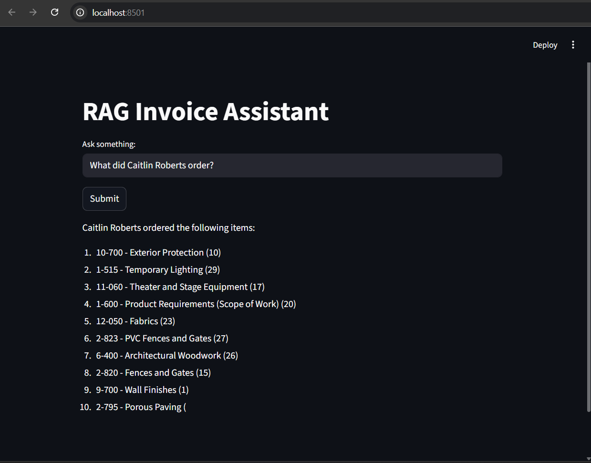

# RAG-Based-Knowledge-Assistant

User Query
   ↓
FAISS (semantic search)
   ↓
Relevant chunks
   ↓
TinyLlama (LLM)
   ↓
Final answer

# checkout the results
query = "What items are in invoice 0012820?"

<!-- query = "What did Caitlin Roberts order?" -->
<!-- query = "What is the total due?" -->

=== FINAL ANSWER ===

Invoice 0012820 includes the following items:

1. 10-700 - Exterior Protection (10)
2. 1-515 - Temporary Lighting (29)
3. 11-060 - Theater and Stage Equipment (17)
4. 1-600 - Product Requirements (Scope of Work) (20)
5. 12-050 - Fabrics (23)
6. 2-823 - PVC Fences and Gates (27)
7. 6-400 - Architectural Woodwork (26)
8. 2-820 - Fences and Gates (15)
9. 9-700 - Wall Finishes (1)
10. 2-795 - Porous Paving (30) 

Prerequisite: python 3 installed and setup properly.

## Install Dependencies
pip install -r requirements.txt

## freeze dependencies (optional)
pip freeze > requirements.txt

## Start API
uvicorn app.main:app --reload

## Start UI
streamlit run ui/streamlit_app.py

# FINAL PROJECT STRUCTURE

rag-system/
│
├── app/
│   ├── main.py              # FastAPI entry point
│   ├── rag.py               # Core RAG logic
│   ├── retriever.py         # FAISS + embeddings
│   ├── llm.py               # TinyLlama setup
│   ├── evaluation.py        # Evaluation logic
│   ├── logger.py            # Logging
│
├── data/                    # PDFs
│
├── ui/
│   └── streamlit_app.py     # UI
│
├── requirements.txt
└── README.md

# HOW EVERYTHING CONNECTS
UI → FastAPI → ask_rag()
                  ↓
        FAISS → retrieve chunks
                  ↓
        expand context
                  ↓
        TinyLlama → generate answer
                  ↓
             response

            